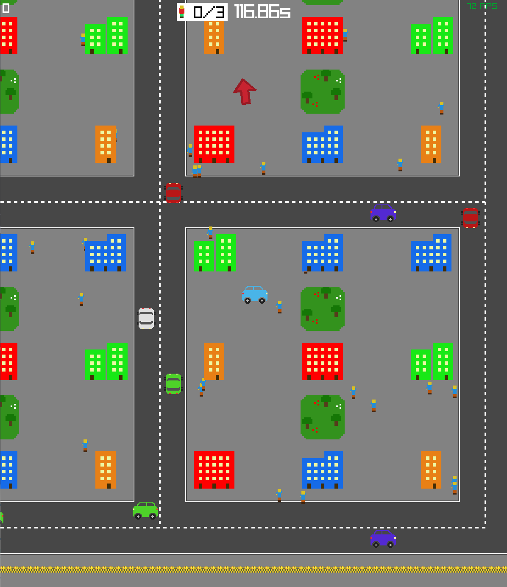

# Busy Taxi



This is a game I made for a [YouTube series](https://www.youtube.com/watch?v=HEoxoIGsHY8&list=PL4EtwuhtXRFx8RKwWeKgEmvyQRQC602cq).

I'm leaving this here for educational purposes for those that want to see the code.

I fixed most of the issues that made the game sort of unplayable, so it should be playable now at least but with a few bugs:

- The customer is drawn behind the buildings
- Other stuff listed in the todo

## Instructions

Clone the repo and you should be able to start the game with:

```bash
zig build run
```

## Controls

- Move the car - wasd
- Brake - space
- Honk - g
